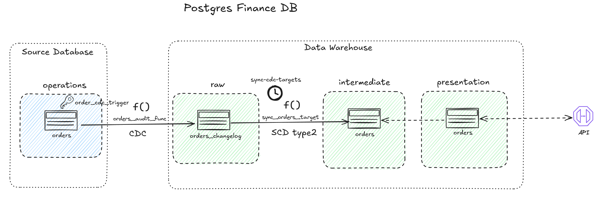

# Data Engineering Take-Home Task

## Welcome
Welcome to Deel's Data Engineering Take-Home task, as mentioned in the Task specification document, this is the pre-built stack that will help you on your solution development. This repository contains a pre-configured database containing the database represented by the following DER:


## Database Configuration

Once you have [Docker](https://www.docker.com/products/docker-desktop/) and [docker-compose](https://docs.docker.com/compose/install/) configured in your computer, with your Docker engine running, you must execute the following command provision the source database:
> docker-compose up
:warning:**Important**: Before running this command make sure you're in the root folder of the project.

Once you have the Database up and running feel free to connect to this using any tool you want, for this you can use the following credentials:

- **Username**: `finance_db_user`
- **Password**: `1234`
- **Database**: `finance_db`

If you opt-in to use CDC tools, we have the following pre-set configurations in the DB:

- **CDC Username**: `cdc_user`
- **CDC User Password**: `cdc_1234`
- **Database**: `finance_db`
- **Replication Slot**: `cdc_pgoutput`
- **Publication Name**: `cdc_publication`

Extra informations and tips about the task execution can be found in the task description document shared by our recruiting team.
For any questions, feel free to reach us out through data-platform@deel.com 

# ACME Analytical Data Platform
The goal of the this project is developing Analytical Data Platform for ACME Delivery Services.
The platform must be able to:

1. Process large amount of data (millions of records)
2. Allow data consumers to query the historical information along with the current orders’ state
data.
3. Offer a dimensional data model to answer the business queries.
4. Provide access to fresh data to consumers as soon as possible (near real-time).

## Project Rational and architecture
As we are bounded to a restricted time limit to develop the Analytical Platform, we are going to focus on using tools and methods that can proove the concept, but are not intended for production.
The main components of our architecture are:
- **Source database (Postgres finance_db.operations):** We are going to use the customized Postgres container provided in the project requirements, deploying it through Docker Compose.
- **Analytical database (Postgres finance_db.raw/intermediate/presentation)**: We decided to use the same Postgres instance as the source database (finance_db.operations), in order to focus on the design of the data pipeline and the data model, instead of the storage infrastructure.
- **CDC tool:** We are going to use Postgres resources like triggers, procedures and functions to replicate a stream process between the source database ("finance_db.operations") and our Warehouse schema "finance_db.raw".
- **Data Modeling resources:** Procedures and Functions created on Postgres finance_db.raw/intermediate/presentation
- **API:** Dockerized FastAPI deployed on the same network as the Postgres finance_db container

## CDC Data Pipeline creation
In this session we are going through the process of creating all the resources needed to synchronize data from the source database and also model it on the Data Warehouse schemas. Make sure to follow every step, creating all the resources indicated in the code blocks in order to be able to successfully test the API Application in the last part.
All the resources indicated here are also defined in individual DDL files in the `sql/` folder, and subfolder `raw`,  `intermediate` and `presentation` reflecting its respective schemas.

### Overview of the data flowing through the 
Below is a diagram representing the main resources used for implementing the CDC logic for the `orders` table. The other tables, `order_items`, `products` and `customers` follow the same logic.


### Synchronization logic
To implement a synchronization between the source database and the Data Warehouse (represented by the raw, intermediate and presentation schemas) we used a CDC approach with a function ({table_name}_audit_func) that responds to triggers ({table_name}_cdc_trigger) based on insert, update or delete events for the source table. The output for this function are records with the event type ('I', 'U' or 'D') for column `operatio`, and also the information about previous data for that record in column `old_data` (as JSON), and the `new_data` (also as JSON).

### Slowly Changing Dimension logic
As all tables can have inplace updates, we decided to use a Slowly Changing Dimension Type-2 approach in order to keep the history for each record. The SCD type-2 operation is performed for each one of the 4 tables by the procedure sync_{table_name}_items_target. Each procedure writes the data from change_logs tables into the respective intermediate tables, adding metadata and also the boolean information for the column `is_current`, which dictates if this record is the last version that reflects the source database.

### Presentation schema
The presentation schema is composed of views that reads from the intermediate tables, filtering by `is_current=True`, resulting in the last updated version for each table, without duplications. This is also the schema used by the API endpoints to return the information requested on the logistic reports.

### Spining up the PostgreSQL database
In order to deploy locally the source Postgres, it was needed a small change to avoid permission issues with the mounted volume directory. The PostgreSQL container needs proper permissions to write to the mounted volume directory `/var/lib/postgresql/data`:
```bash
mkdir -p db-data
sudo chown -R 999:999 db-data
```
Next, the PostgreSQL (and the FastAPI) can be deployed using:
```bash
docker compose up
```
We used [Beekeeper Studio](https://www.beekeeperstudio.io/) SQL Client to perform all the testing and resource creation described in the next sessions.


### DDLs and DMLs for the Data Pipeline
In this session we are going to define the DDLs and DMLs needed to create all the Postgres resources for the implementation of the Data Pipeline. Make sure to execure it in sequence.

#### Schemas and tables DDL
In this session we are going to create the target schemas and tables our Data Platform.
```sql
create schema raw;
create schema intermediate;
create schema presentation;

-- Creating the SCD type 2 tables
-- orders
CREATE TABLE intermediate.orders (
    version_id BIGSERIAL PRIMARY KEY,
    order_id BIGINT NOT NULL,
    order_date DATE,
    delivery_date DATE,
    customer_id BIGINT,
    status VARCHAR,
    updated_at TIMESTAMP(3),
    updated_by BIGINT,
    created_at TIMESTAMP(3),
    created_by BIGINT,
    effective_start TIMESTAMPTZ NOT NULL,
    effective_end TIMESTAMPTZ,
    is_current BOOLEAN NOT NULL DEFAULT true,
    operation_type CHAR(1) NOT NULL CHECK (operation_type IN ('I','U','D')),
    change_timestamp TIMESTAMPTZ NOT NULL
);

CREATE INDEX ON intermediate.orders (order_id);
CREATE INDEX ON intermediate.orders (is_current);
CREATE INDEX ON intermediate.orders (change_timestamp);

-- order_items
CREATE TABLE intermediate.order_items (
    version_id BIGSERIAL PRIMARY KEY,
    order_item_id bigserial NOT NULL,
    order_id bigint NULL,
    product_id bigint NULL,
    quanity integer NULL,
    updated_at timestamp(3) without time zone NULL DEFAULT CURRENT_TIMESTAMP(3),
    updated_by bigint NULL,
    created_at timestamp(3) without time zone NULL DEFAULT CURRENT_TIMESTAMP(3),
    created_by bigint NULL,
    effective_start TIMESTAMPTZ NOT NULL,
    effective_end TIMESTAMPTZ,
    is_current BOOLEAN NOT NULL DEFAULT true,
    operation_type CHAR(1) NOT NULL CHECK (operation_type IN ('I','U','D')),
    change_timestamp TIMESTAMPTZ NOT NULL
  );

CREATE INDEX ON intermediate.order_items (order_id);
CREATE INDEX ON intermediate.order_items (is_current);
CREATE INDEX ON intermediate.order_items (change_timestamp);

-- customers
CREATE TABLE intermediate.customers (
    version_id BIGSERIAL PRIMARY KEY,
    customer_id bigserial NOT NULL,
    customer_name character varying(500) NOT NULL,
    is_active boolean NOT NULL DEFAULT true,
    customer_address character varying(500) NULL,
    updated_at timestamp(3) without time zone NULL DEFAULT CURRENT_TIMESTAMP(3),
    updated_by bigint NULL,
    created_at timestamp(3) without time zone NULL DEFAULT CURRENT_TIMESTAMP(3),
    created_by bigint NULL,
    effective_start TIMESTAMPTZ NOT NULL,
    effective_end TIMESTAMPTZ,
    is_current BOOLEAN NOT NULL DEFAULT true,
    operation_type CHAR(1) NOT NULL CHECK (operation_type IN ('I','U','D')),
    change_timestamp TIMESTAMPTZ NOT NULL
  );
  
-- products
CREATE TABLE intermediate.products (
    version_id BIGSERIAL PRIMARY KEY,
    product_id bigserial NOT NULL,
    product_name character varying(500) NOT NULL,
    barcode character varying(26) NOT NULL,
    unity_price numeric NOT NULL,
    is_active boolean NULL,
    updated_at timestamp(3) without time zone NULL DEFAULT CURRENT_TIMESTAMP(3),
    updated_by bigint NULL,
    created_at timestamp(3) without time zone NULL DEFAULT CURRENT_TIMESTAMP(3),
    created_by bigint NULL,
    effective_start TIMESTAMPTZ NOT NULL,
    effective_end TIMESTAMPTZ,
    is_current BOOLEAN NOT NULL DEFAULT true,
    operation_type CHAR(1) NOT NULL CHECK (operation_type IN ('I','U','D')),
    change_timestamp TIMESTAMPTZ NOT NULL
  );
```
And also the presentation schema views.
```sql
-- Creating presentation layer views
CREATE OR REPLACE VIEW presentation.orders AS
SELECT
    order_id,
    order_date,
    delivery_date,
    customer_id,
    status,
    updated_at,
    updated_by,
    created_at,
    created_by
FROM intermediate.orders
WHERE is_current = true;

--
CREATE OR REPLACE VIEW presentation.order_items AS
SELECT
    order_item_id,
    order_id,
    product_id,
    quanity AS quantity,
    updated_at,
    updated_by,
    created_at,
    created_by
FROM intermediate.order_items
WHERE is_current = true;

CREATE OR REPLACE VIEW presentation.products AS
SELECT
    product_id,
    product_name,
    barcode,
    unity_price,
    is_active,
    updated_at,
    updated_by,
    created_at,
    created_by
FROM intermediate.products
WHERE is_current = true;

CREATE OR REPLACE VIEW presentation.customers AS
SELECT
    customer_id,
    customer_name,
    is_active,
    customer_address,
    updated_at,
    updated_by,
    created_at,
    created_by
FROM intermediate.customers
WHERE is_current = true;
```

#### Order Pipeline
```sql
-- Create orders changelog table
CREATE TABLE raw.orders_changelog (
    change_id BIGSERIAL PRIMARY KEY,
    operation CHAR(1) NOT NULL CHECK (operation IN ('I','U','D')),
    old_data JSONB,
    new_data JSONB,
    changed_by TEXT DEFAULT CURRENT_USER,
    changed_at TIMESTAMPTZ DEFAULT NOW()
);

CREATE INDEX ON raw.orders_changelog (changed_at);

-- Create trigger function for orders
CREATE OR REPLACE FUNCTION raw.orders_audit_func()
RETURNS TRIGGER AS $$
BEGIN
    IF (TG_OP = 'DELETE') THEN
        INSERT INTO raw.orders_changelog (operation, old_data)
        VALUES ('D', to_jsonb(OLD));
        RETURN OLD;
    ELSIF (TG_OP = 'UPDATE') THEN
        INSERT INTO raw.orders_changelog (operation, old_data, new_data)
        VALUES ('U', to_jsonb(OLD), to_jsonb(NEW));
        RETURN NEW;
    ELSIF (TG_OP = 'INSERT') THEN
        INSERT INTO raw.orders_changelog (operation, new_data)
        VALUES ('I', to_jsonb(NEW));
        RETURN NEW;
    END IF;
    RETURN NULL;
END;
$$ LANGUAGE plpgsql;

-- Backfill existing order records
INSERT INTO raw.orders_changelog (operation, new_data, changed_by, changed_at)
SELECT 
    'I', 
    to_jsonb(o), 
    CURRENT_USER, 
    NOW()
FROM operations.orders o;  -- Assuming source table is operations.orders

-- Create trigger for order changes
CREATE TRIGGER orders_cdc_trigger
AFTER INSERT OR UPDATE OR DELETE ON operations.orders
FOR EACH ROW EXECUTE FUNCTION raw.orders_audit_func();

-- Initialize CDC sync state for orders
INSERT INTO intermediate.cdc_sync_state (table_name) 
VALUES ('operations.orders') 
ON CONFLICT DO NOTHING;

-- Create order type
CREATE TYPE intermediate.order_type AS (
    order_id BIGINT,
    order_date DATE,
    delivery_date DATE,
    customer_id BIGINT,
    status VARCHAR,
    updated_at TIMESTAMP(3),
    updated_by BIGINT,
    created_at TIMESTAMP(3),
    created_by BIGINT
);

-- Create sync procedure for orders
CREATE OR REPLACE PROCEDURE intermediate.sync_orders_target()
LANGUAGE plpgsql AS $$
DECLARE
    _last_id BIGINT;
    _change RECORD;
    _new_row intermediate.order_type;
    _old_row intermediate.order_type;
BEGIN
    SELECT last_processed_change_id INTO _last_id
    FROM intermediate.cdc_sync_state
    WHERE table_name = 'operations.orders';

    FOR _change IN
        SELECT change_id, operation, old_data, new_data, changed_at
        FROM raw.orders_changelog
        WHERE change_id > _last_id
        ORDER BY change_id
    LOOP
        IF _change.operation = 'I' THEN
            _new_row := jsonb_populate_record(null::intermediate.order_type, _change.new_data);
            
            INSERT INTO intermediate.orders (
                order_id, order_date, delivery_date, customer_id, status,
                updated_at, updated_by, created_at, created_by,
                effective_start, operation_type, change_timestamp
            )
            VALUES (
                _new_row.order_id,
                _new_row.order_date,
                _new_row.delivery_date,
                _new_row.customer_id,
                _new_row.status,
                _new_row.updated_at,
                _new_row.updated_by,
                _new_row.created_at,
                _new_row.created_by,
                _change.changed_at,
                'I',
                _change.changed_at
            );

        ELSIF _change.operation = 'U' THEN
            _new_row := jsonb_populate_record(null::intermediate.order_type, _change.new_data);
            
            UPDATE intermediate.orders
            SET effective_end = _change.changed_at,
                is_current = false
            WHERE order_id = _new_row.order_id
              AND is_current = true;

            INSERT INTO intermediate.orders (
                order_id, order_date, delivery_date, customer_id, status,
                updated_at, updated_by, created_at, created_by,
                effective_start, operation_type, change_timestamp
            )
            VALUES (
                _new_row.order_id,
                _new_row.order_date,
                _new_row.delivery_date,
                _new_row.customer_id,
                _new_row.status,
                _new_row.updated_at,
                _new_row.updated_by,
                _new_row.created_at,
                _new_row.created_by,
                _change.changed_at,
                'U',
                _change.changed_at
            );

        ELSIF _change.operation = 'D' THEN
            _old_row := jsonb_populate_record(null::intermediate.order_type, _change.old_data);
            
            UPDATE intermediate.orders
            SET effective_end = _change.changed_at,
                is_current = false,
                operation_type = 'D'
            WHERE order_id = _old_row.order_id
              AND is_current = true;
        END IF;

        _last_id := _change.change_id;
    END LOOP;

    UPDATE intermediate.cdc_sync_state
    SET last_processed_change_id = _last_id
    WHERE table_name = 'operations.orders';

    COMMIT;
END;
$$;

-- Test the sync
CALL intermediate.sync_orders_target();

-- Validate counts
SELECT COUNT(1) FROM raw.orders_changelog;
SELECT COUNT(1) FROM intermediate.orders;

```
#### Order Items Pipeline
```sql
-- Create changelog table
CREATE TABLE raw.order_items_changelog (
    change_id BIGSERIAL PRIMARY KEY,
    operation CHAR(1) NOT NULL CHECK (operation IN ('I','U','D')),
    old_data JSONB,
    new_data JSONB,
    changed_by TEXT DEFAULT CURRENT_USER,
    changed_at TIMESTAMPTZ DEFAULT NOW()
);

CREATE INDEX ON raw.order_items_changelog (changed_at);

-- Create trigger function
CREATE OR REPLACE FUNCTION raw.order_items_audit_func()
RETURNS TRIGGER AS $$
BEGIN
    IF (TG_OP = 'DELETE') THEN
        INSERT INTO raw.order_items_changelog (operation, old_data)
        VALUES ('D', to_jsonb(OLD));
        RETURN OLD;
    ELSIF (TG_OP = 'UPDATE') THEN
        INSERT INTO raw.order_items_changelog (operation, old_data, new_data)
        VALUES ('U', to_jsonb(OLD), to_jsonb(NEW));
        RETURN NEW;
    ELSIF (TG_OP = 'INSERT') THEN
        INSERT INTO raw.order_items_changelog (operation, new_data)
        VALUES ('I', to_jsonb(NEW));
        RETURN NEW;
    END IF;
    RETURN NULL;
END;
$$ LANGUAGE plpgsql;

-- Backfill existing records as initial inserts
-- truncate table raw.order_items_changelog;
INSERT INTO raw.order_items_changelog (operation, new_data, changed_by, changed_at)
SELECT 
    'I', 
    to_jsonb(oi), 
    CURRENT_USER, 
    NOW()
FROM finance_db.operations.order_items oi;

-- Create trigger for future changes
-- DROP TRIGGER IF EXISTS order_items_cdc_trigger ON operations.order_items;
CREATE TRIGGER order_items_cdc_trigger
AFTER INSERT OR UPDATE OR DELETE ON operations.order_items
FOR EACH ROW EXECUTE FUNCTION raw.order_items_audit_func();

select count(1) from raw.order_items_changelog;
select count(1) from operations.order_items;
--

SELECT COUNT(*) FROM raw.order_items_changelog WHERE operation != 'I';

-- Creating the logic for updating the intermediate table
-- Tracks last processed change ID
CREATE TABLE intermediate.cdc_sync_state (
    table_name TEXT PRIMARY KEY,
    last_processed_change_id BIGINT NOT NULL DEFAULT 0
);

-- Initialize for orders table
INSERT INTO intermediate.cdc_sync_state (table_name) 
VALUES ('operations.order_items') 
ON CONFLICT DO NOTHING;

select * from intermediate.cdc_sync_state;

CREATE TYPE intermediate.order_item_type AS (
    order_item_id BIGINT,
    order_id BIGINT,
    product_id BIGINT,
    quanity INTEGER,
    updated_at TIMESTAMP(3),
    updated_by BIGINT,
    created_at TIMESTAMP(3),
    created_by BIGINT
);

CREATE OR REPLACE PROCEDURE intermediate.sync_order_items_target()
LANGUAGE plpgsql AS $$
DECLARE
    _last_id BIGINT;
    _change RECORD;
    _new_row intermediate.order_item_type;
    _old_row intermediate.order_item_type;
BEGIN
    SELECT last_processed_change_id INTO _last_id
    FROM intermediate.cdc_sync_state
    WHERE table_name = 'operations.order_items';

    FOR _change IN
        SELECT change_id, operation, old_data, new_data, changed_at
        FROM raw.order_items_changelog
        WHERE change_id > _last_id
        ORDER BY change_id
    LOOP
        IF _change.operation = 'I' THEN
            _new_row := jsonb_populate_record(null::intermediate.order_item_type, _change.new_data);
            
            INSERT INTO intermediate.order_items (
                order_item_id, order_id, product_id, quanity,
                updated_at, updated_by, created_at, created_by,
                effective_start, operation_type, change_timestamp
            )
            VALUES (
                _new_row.order_item_id,
                _new_row.order_id,
                _new_row.product_id,
                _new_row.quanity,
                _new_row.updated_at,
                _new_row.updated_by,
                _new_row.created_at,
                _new_row.created_by,
                _change.changed_at,
                'I',
                _change.changed_at
            );

        ELSIF _change.operation = 'U' THEN
            _new_row := jsonb_populate_record(null::intermediate.order_item_type, _change.new_data);
            
            UPDATE intermediate.order_items
            SET effective_end = _change.changed_at,
                is_current = false
            WHERE order_item_id = _new_row.order_item_id
              AND is_current = true;

            INSERT INTO intermediate.order_items (
                order_item_id, order_id, product_id, quanity,
                updated_at, updated_by, created_at, created_by,
                effective_start, operation_type, change_timestamp
            )            
            VALUES (
                    _new_row.order_item_id,
                _new_row.order_id,
                _new_row.product_id,
                _new_row.quanity,
                _new_row.updated_at,
                _new_row.updated_by,
                _new_row.created_at,
                _new_row.created_by,
                _change.changed_at,
                'I',
                _change.changed_at
            );

        ELSIF _change.operation = 'D' THEN
            _old_row := jsonb_populate_record(null::intermediate.order_item_type, _change.old_data);
            
            UPDATE intermediate.order_items
            SET effective_end = _change.changed_at,
                is_current = false,
                operation_type = 'D'
            WHERE order_item_id = _old_row.order_item_id
              AND is_current = true;
        END IF;

        _last_id := _change.change_id;
    END LOOP;

    UPDATE intermediate.cdc_sync_state
    SET last_processed_change_id = _last_id
    WHERE table_name = 'operations.order_items';

    COMMIT;
END;
$$;


CALL intermediate.sync_order_items_target();

select count(1) from intermediate.order_items;
```

#### Products Pipeline
```sql
-- Create products changelog table
CREATE TABLE raw.products_changelog (
    change_id BIGSERIAL PRIMARY KEY,
    operation CHAR(1) NOT NULL CHECK (operation IN ('I','U','D')),
    old_data JSONB,
    new_data JSONB,
    changed_by TEXT DEFAULT CURRENT_USER,
    changed_at TIMESTAMPTZ DEFAULT NOW()
);

CREATE INDEX ON raw.products_changelog (changed_at);

-- Create trigger function for products
CREATE OR REPLACE FUNCTION raw.products_audit_func()
RETURNS TRIGGER AS $$
BEGIN
    IF (TG_OP = 'DELETE') THEN
        INSERT INTO raw.products_changelog (operation, old_data)
        VALUES ('D', to_jsonb(OLD));
        RETURN OLD;
    ELSIF (TG_OP = 'UPDATE') THEN
        INSERT INTO raw.products_changelog (operation, old_data, new_data)
        VALUES ('U', to_jsonb(OLD), to_jsonb(NEW));
        RETURN NEW;
    ELSIF (TG_OP = 'INSERT') THEN
        INSERT INTO raw.products_changelog (operation, new_data)
        VALUES ('I', to_jsonb(NEW));
        RETURN NEW;
    END IF;
    RETURN NULL;
END;
$$ LANGUAGE plpgsql;

-- Backfill existing product records
INSERT INTO raw.products_changelog (operation, new_data, changed_by, changed_at)
SELECT 
    'I', 
    to_jsonb(p), 
    CURRENT_USER, 
    NOW()
FROM operations.products p;

select count(1) from raw.products_changelog;

-- Create trigger for product changes
CREATE TRIGGER products_cdc_trigger
AFTER INSERT OR UPDATE OR DELETE ON operations.products
FOR EACH ROW EXECUTE FUNCTION raw.products_audit_func();

-- Initialize CDC sync state for products
INSERT INTO intermediate.cdc_sync_state (table_name) 
VALUES ('operations.products') 
ON CONFLICT DO NOTHING;

-- Create product type
CREATE TYPE intermediate.product_type AS (
    product_id BIGINT,
    product_name VARCHAR(500),
    barcode VARCHAR(26),
    unity_price NUMERIC,
    is_active BOOLEAN,
    updated_at TIMESTAMP(3),
    updated_by BIGINT,
    created_at TIMESTAMP(3),
    created_by BIGINT
);

-- Create sync procedure for products
CREATE OR REPLACE PROCEDURE intermediate.sync_products_target()
LANGUAGE plpgsql AS $$
DECLARE
    _last_id BIGINT;
    _change RECORD;
    _new_row intermediate.product_type;
    _old_row intermediate.product_type;
BEGIN
    SELECT last_processed_change_id INTO _last_id
    FROM intermediate.cdc_sync_state
    WHERE table_name = 'operations.products';

    FOR _change IN
        SELECT change_id, operation, old_data, new_data, changed_at
        FROM raw.products_changelog
        WHERE change_id > _last_id
        ORDER BY change_id
    LOOP
        IF _change.operation = 'I' THEN
            _new_row := jsonb_populate_record(null::intermediate.product_type, _change.new_data);
            
            INSERT INTO intermediate.products (
                product_id, product_name, barcode, unity_price, is_active,
                updated_at, updated_by, created_at, created_by,
                effective_start, operation_type, change_timestamp
            )
            VALUES (
                _new_row.product_id,
                _new_row.product_name,
                _new_row.barcode,
                _new_row.unity_price,
                _new_row.is_active,
                _new_row.updated_at,
                _new_row.updated_by,
                _new_row.created_at,
                _new_row.created_by,
                _change.changed_at,
                'I',
                _change.changed_at
            );

        ELSIF _change.operation = 'U' THEN
            _new_row := jsonb_populate_record(null::intermediate.product_type, _change.new_data);
            
            UPDATE intermediate.products
            SET effective_end = _change.changed_at,
                is_current = false
            WHERE product_id = _new_row.product_id
              AND is_current = true;

            INSERT INTO intermediate.products (
                product_id, product_name, barcode, unity_price, is_active,
                updated_at, updated_by, created_at, created_by,
                effective_start, operation_type, change_timestamp
            )
            VALUES (
                _new_row.product_id,
                _new_row.product_name,
                _new_row.barcode,
                _new_row.unity_price,
                _new_row.is_active,
                _new_row.updated_at,
                _new_row.updated_by,
                _new_row.created_at,
                _new_row.created_by,
                _change.changed_at,
                'U',
                _change.changed_at
            );

        ELSIF _change.operation = 'D' THEN
            _old_row := jsonb_populate_record(null::intermediate.product_type, _change.old_data);
            
            UPDATE intermediate.products
            SET effective_end = _change.changed_at,
                is_current = false,
                operation_type = 'D'
            WHERE product_id = _old_row.product_id
              AND is_current = true;
        END IF;

        _last_id := _change.change_id;
    END LOOP;

    UPDATE intermediate.cdc_sync_state
    SET last_processed_change_id = _last_id
    WHERE table_name = 'operations.products';

    COMMIT;
END;
$$;

-- Test the sync
CALL intermediate.sync_products_target();

-- Verify counts
SELECT COUNT(1) FROM raw.products_changelog;
SELECT COUNT(1) FROM intermediate.products;
```

#### Customers Pipeline
```sql
-- Create customers changelog table
CREATE TABLE raw.customers_changelog (
    change_id BIGSERIAL PRIMARY KEY,
    operation CHAR(1) NOT NULL CHECK (operation IN ('I','U','D')),
    old_data JSONB,
    new_data JSONB,
    changed_by TEXT DEFAULT CURRENT_USER,
    changed_at TIMESTAMPTZ DEFAULT NOW()
);

CREATE INDEX ON raw.customers_changelog (changed_at);

-- Create trigger function for customers
CREATE OR REPLACE FUNCTION raw.customers_audit_func()
RETURNS TRIGGER AS $$
BEGIN
    IF (TG_OP = 'DELETE') THEN
        INSERT INTO raw.customers_changelog (operation, old_data)
        VALUES ('D', to_jsonb(OLD));
        RETURN OLD;
    ELSIF (TG_OP = 'UPDATE') THEN
        INSERT INTO raw.customers_changelog (operation, old_data, new_data)
        VALUES ('U', to_jsonb(OLD), to_jsonb(NEW));
        RETURN NEW;
    ELSIF (TG_OP = 'INSERT') THEN
        INSERT INTO raw.customers_changelog (operation, new_data)
        VALUES ('I', to_jsonb(NEW));
        RETURN NEW;
    END IF;
    RETURN NULL;
END;
$$ LANGUAGE plpgsql;

-- Backfill existing customer records
INSERT INTO raw.customers_changelog (operation, new_data, changed_by, changed_at)
SELECT 
    'I', 
    to_jsonb(c), 
    CURRENT_USER, 
    NOW()
FROM operations.customers c;  -- Assuming source table is operations.customers

-- Create trigger for customer changes
CREATE TRIGGER customers_cdc_trigger
AFTER INSERT OR UPDATE OR DELETE ON operations.customers
FOR EACH ROW EXECUTE FUNCTION raw.customers_audit_func();

-- Initialize CDC sync state for customers
INSERT INTO intermediate.cdc_sync_state (table_name) 
VALUES ('operations.customers') 
ON CONFLICT DO NOTHING;

-- Create customer type
CREATE TYPE intermediate.customer_type AS (
    customer_id BIGINT,
    customer_name VARCHAR(500),
    is_active BOOLEAN,
    customer_address VARCHAR(500),
    updated_at TIMESTAMP(3),
    updated_by BIGINT,
    created_at TIMESTAMP(3),
    created_by BIGINT
);

-- Create sync procedure for customers
CREATE OR REPLACE PROCEDURE intermediate.sync_customers_target()
LANGUAGE plpgsql AS $$
DECLARE
    _last_id BIGINT;
    _change RECORD;
    _new_row intermediate.customer_type;
    _old_row intermediate.customer_type;
BEGIN
    SELECT last_processed_change_id INTO _last_id
    FROM intermediate.cdc_sync_state
    WHERE table_name = 'operations.customers';

    FOR _change IN
        SELECT change_id, operation, old_data, new_data, changed_at
        FROM raw.customers_changelog
        WHERE change_id > _last_id
        ORDER BY change_id
    LOOP
        IF _change.operation = 'I' THEN
            _new_row := jsonb_populate_record(null::intermediate.customer_type, _change.new_data);
            
            INSERT INTO intermediate.customers (
                customer_id, customer_name, is_active, customer_address,
                updated_at, updated_by, created_at, created_by,
                effective_start, operation_type, change_timestamp
            )
            VALUES (
                _new_row.customer_id,
                _new_row.customer_name,
                _new_row.is_active,
                _new_row.customer_address,
                _new_row.updated_at,
                _new_row.updated_by,
                _new_row.created_at,
                _new_row.created_by,
                _change.changed_at,
                'I',
                _change.changed_at
            );

        ELSIF _change.operation = 'U' THEN
            _new_row := jsonb_populate_record(null::intermediate.customer_type, _change.new_data);
            
            UPDATE intermediate.customers
            SET effective_end = _change.changed_at,
                is_current = false
            WHERE customer_id = _new_row.customer_id
              AND is_current = true;

            INSERT INTO intermediate.customers (
                customer_id, customer_name, is_active, customer_address,
                updated_at, updated_by, created_at, created_by,
                effective_start, operation_type, change_timestamp
            )
            VALUES (
                _new_row.customer_id,
                _new_row.customer_name,
                _new_row.is_active,
                _new_row.customer_address,
                _new_row.updated_at,
                _new_row.updated_by,
                _new_row.created_at,
                _new_row.created_by,
                _change.changed_at,
                'U',
                _change.changed_at
            );

        ELSIF _change.operation = 'D' THEN
            _old_row := jsonb_populate_record(null::intermediate.customer_type, _change.old_data);
            
            UPDATE intermediate.customers
            SET effective_end = _change.changed_at,
                is_current = false,
                operation_type = 'D'
            WHERE customer_id = _old_row.customer_id
              AND is_current = true;
        END IF;

        _last_id := _change.change_id;
    END LOOP;

    UPDATE intermediate.cdc_sync_state
    SET last_processed_change_id = _last_id
    WHERE table_name = 'operations.customers';

    COMMIT;
END;
$$;

-- Test the sync
CALL intermediate.sync_customers_target();

--
select count(1) from raw.customers_changelog;
select count(1) from intermediate.customers;
```

### Automating the load with a CRON Job
In order to automate the loading from the change log tables to the SCD type tables we created a CRON Job that calls the procedures, scheduled to be run every 3 minutes.
```sql
CREATE EXTENSION IF NOT EXISTS pg_cron;
SELECT cron.schedule(
    'sync-cdc-targets',
    '*/3 * * * *',  -- Every 3 minutes
    $$
    CALL intermediate.sync_customers_target();
    CALL intermediate.sync_products_target();
    CALL intermediate.sync_orders_target();
    CALL intermediate.sync_order_items_target();
    $$
);
```
So based on what was presented in this session, the data downtime between source database and the Analytical platform is 3 minutes.

## API Development
The last part of the project requirement was the development of an API that enabled users to fetch the  information from the Data Platform, with the following endpoints:
-  GET /analytics/orders?status=open: To retrieve information about the number
of open orders by DELIVERY_DATE and STATUS
- GET /analytics/orders/top?limit=3: To retrieve information about the Top 3
delivery dates with more open orders
- GET /analytics/orders/product: To retrieve information about the number of
open pending items by PRODUCT_ID, this information can be queried using the
order status and the order items
- /analytics/orders/customers/?status=open&limit=3: To retrieve information
about top 3 Customers with more pending orders

We used FastAPI to develop the resources for the API (can be found on the `/api` folder). We also modified the original Docker Compose with the Postgres source database to also contain a container running the FastAPI backend. 

### Testing the API endpoints
With the application deployed through Docker Compose, we are able to test the API endpoints to return the requested reports:
```bash
# Health check
curl http://localhost:8000/health

# Analytics endpoints
curl "http://localhost:8000/analytics/orders?status=open"
curl "http://localhost:8000/analytics/orders/top?limit=3"
curl "http://localhost:8000/analytics/orders/product"
curl "http://localhost:8000/analytics/orders/customers?status=open&limit=3"
```

## Final thoughts
As mentioned in the project introduction, the architecture we have implemented is focus on showing the concept of integrating a near real-time transactional database, with a Data Analytical Platform in order to provide report resources for the logistic department. With the proof of concept validated by the stakeholders, the next step would invariably move into the discussion of a robust and resilient Data architecture that can offer the resources presented in the PoC, without the limitations.
The diagram below ilustrates a suggested Data Architecture that relies on Cloud Services to achieve it.

This architecture would have the following components:
1. Source System: In our case it would still be the Postgres we worked on the PoC, deployed on a more reliable way in multiple Availability Zones, probably an AWS RDS, with a read-replica.
2. Streaming Layer: This component would replace the change log tables and audit functions with triggers we created with Postgres. AWS has recently release a new feature for streaming between OLTPs like Postgres and MySQL hosted in RDS straight to Iceberg Tables on S3, through Kinesis Firehose. This could be an easy way to implement the streaming process. But also, we could use other services like AWS DMS or MSK.
3. Storage and Processing Layer: This would be the core layer of our Analytical Platform, as we would use Snowflake storage and processing power. Snowflake is a modern Cloud Data Warehouse, with a focus on data consumers, but a lot of features in terms of integration. Snowflake allows us to access Iceberg Tables as part of its data catalog, meaning we could have access data that's being streamed to S3 right away, in a near real-time fashion, without having to replicate it in Snowflake internal storage. For the other schemas like INTERMEDIATE and PRESENTATION, we could use Snowflake storage
4. Orchestration Layer: We would use dbt as the ETL + Semantic Layer, combined with Airflow as Orchestrator. These two tools are a really powerful combination, enabling pretty much any type of data transformation.
5. Presentation Layer: To enable access to the processed data in Snowflake PRESENTATION schema, we could deploy our Dockerized FastAPI application using AWS ECS, and also use API Gateway as security layer between the requests coming from outside our VPC, and our Application. 

## Project limitations
1. Describe the limitation of using Postgres (OLTP) as warehouse, list other OLAPs that could be used (Snowflake, Redshift, ClickHouse, Databricks)
2. Airflow deployment using Astro CLI -> use a managed service or Kubernetes

## Next steps
1. DRY refactoring: Modularize the SQL code, avoiding the creation of repetitive functions and procedures by replacing hardcode variables as parameters


## References:
- [PostgreSQL Change Data Capture (CDC): The Complete Guide (DataCater)](https://datacater.io/blog/2021-09-02/postgresql-cdc-complete-guide.html)
- [Near Real-Time Database Replication to Apache Iceberg Table on S3 Using Amazon Data Firehose](https://community.aws/content/2rvtWCLKdAE2snztqfUiuMLwR2q/near-real-time-database-replication-to-apache-iceberg-table-on-s3-using-amazon-data-firehose)
- [FastAPI Documentation](https://fastapi.tiangolo.com/reference/)